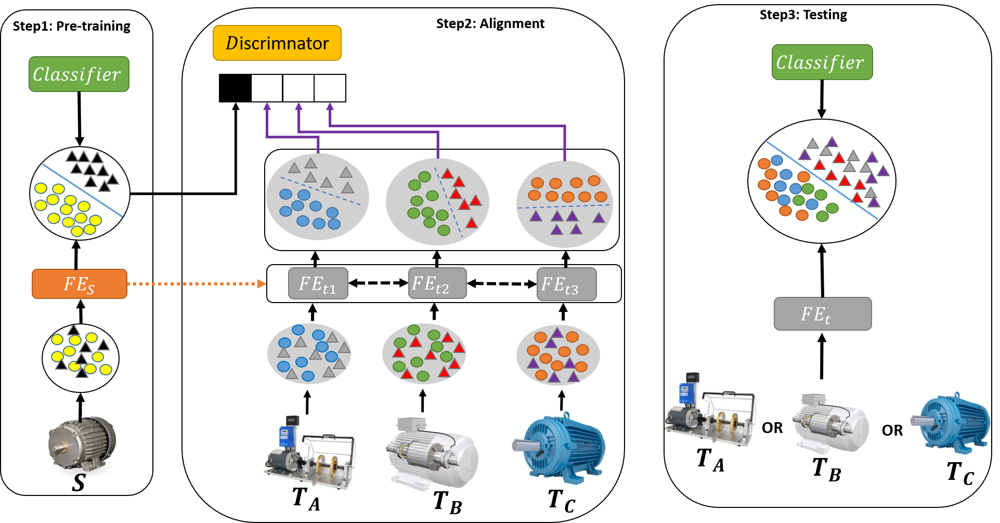

# Aversarial-Multiple-Domain-Adaptation-for-Fault-Diagnosis (AMDA) [[Paper](https://ieeexplore.ieee.org/abstract/document/9141312)]
#### *by: Mohamed Ragab, Zhenghua Chen, Min Wu, Haoliang Li, Chee Keong Kwoh, Ruqiang Yan, and  Xiaoli Li*
#### IEEE Transactions on Instrumentation and Measurement (TIM-21) (Impact Factor: 4.06).

## Abstract

Data-driven fault classification methods are receiving great attention as they can be applied to many real-world applications. However, they work under the assumption that training data and testing data are drawn from the same distribution. Practical scenarios have varying operating conditions, which results in a domain-shift problem that significantly deteriorates the diagnosis performance. Recently, domain adaptation (DA) has been explored to address the domain-shift problem by transferring the knowledge from labeled source domain (e.g., source working condition) to unlabeled target domain (e.g., target working condition). Yet, all the existing methods are working under single-source single-target (1S1T) settings. Hence, a new model needs to be trained for each new target domain. This shows limited scalability in handling multiple working conditions since different models should be trained for different target working conditions, which is clearly not a viable solution in practice. To address this problem, we propose a novel adversarial multiple-target DA (AMDA) method for single-source multiple-target (1SmT) scenario, where the model can generalize to multiple-target domains concurrently. Adversarial adaptation is applied to transform the multiple-target domain features to be invariant from the single-source-domain features. This leads to a scalable model with a novel capability of generalizing to multiple-target domains. Extensive experiments on two public datasets and one self-collected dataset have demonstrated that the proposed method outperforms state-of-the-art methods consistently.

## Requirmenets:
- Python3.x
- Pytorch==1.7
- Numpy
- Sklearn
- Pandas
- mat4py (for Fault diagnosis preprocessing)

## Datasets
### Download datasets
We used four public datasets in this study:
- [CWRU Dataset](https://csegroups.case.edu/bearingdatacenter/pages/welcome-case-western-reserve-university-bearing-data-center-website) 
- [Paderborn Dataset](https://mb.uni-paderborn.de/en/kat/main-research/datacenter/bearing-datacenter/data-sets-and-download)

### Preparing datasets
1. Use the provided datapreprocessing codes to process the data. 
2. To process CWRU Dataset run the notebook in "CWRU_PreProcessing"   
3. To process Paderborn Dataset run the notebook in "KAT_PreProcessing"


### Reprodunce the results:
1. Clone the repository 
2. Download the fault diagnosis datsets. 
3. Use the provided datapreprocessing codes to process the data. 
4. Run AMDA (1SmT).

## Citation
If you found this work useful for you, please consider citing it.
```
@article{amda_tim,
  author={Ragab, Mohamed and Chen, Zhenghua and Wu, Min and Li, Haoliang and Kwoh, Chee-Keong and Yan, Ruqiang and Li, Xiaoli},
  journal={IEEE Transactions on Instrumentation and Measurement}, 
  title={Adversarial Multiple-Target Domain Adaptation for Fault Classification}, 
  year={2021},
  volume={70},
  number={},
  pages={1-11},
  doi={10.1109/TIM.2020.3009341}}
```

## Contact
For any issues/questions regarding the paper or reproducing the results, please contact me.   
Mohamed Ragab    
School of Computer Science and Engineering (SCSE),   
Nanyang Technological University (NTU), Singapore.   
Email: mohamedr002{at}e.ntu.edu.sg   
